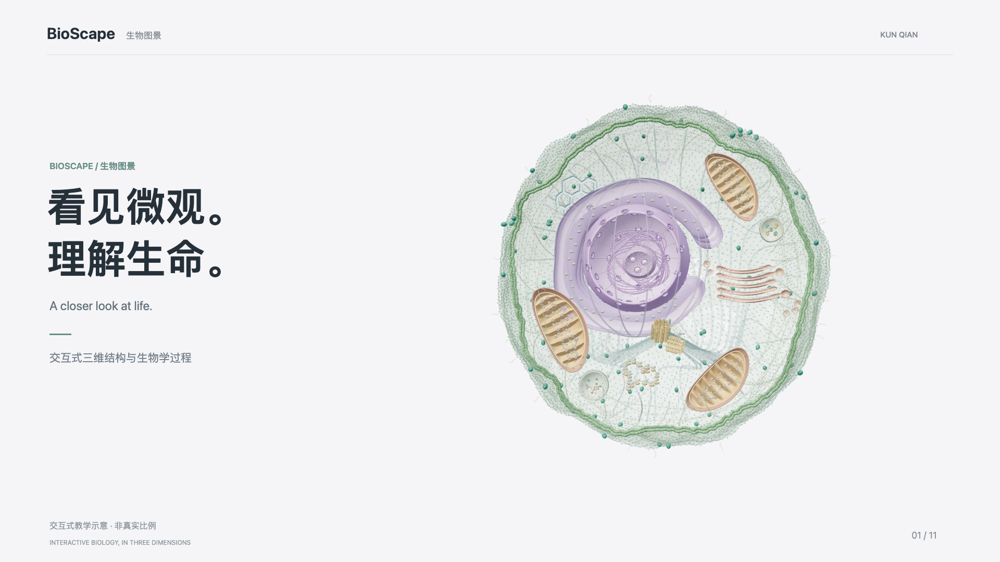
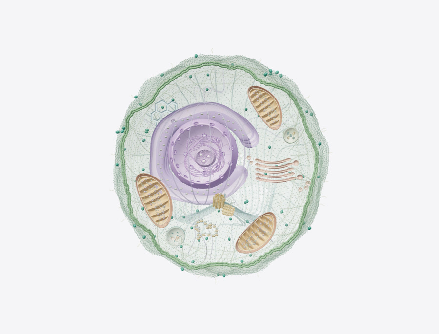
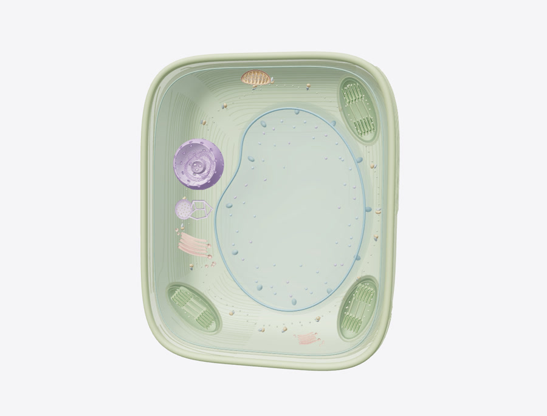
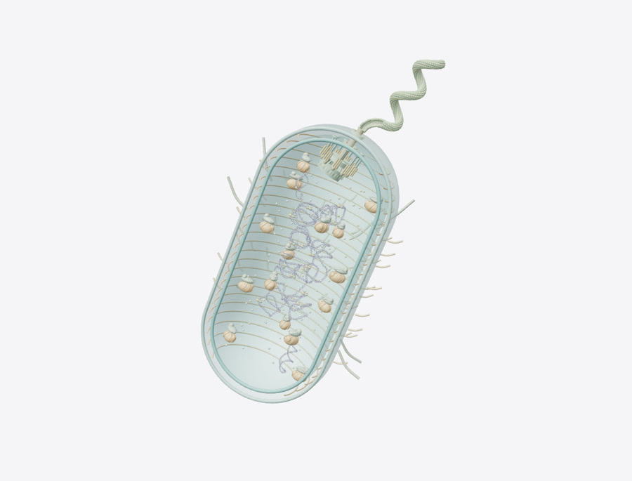
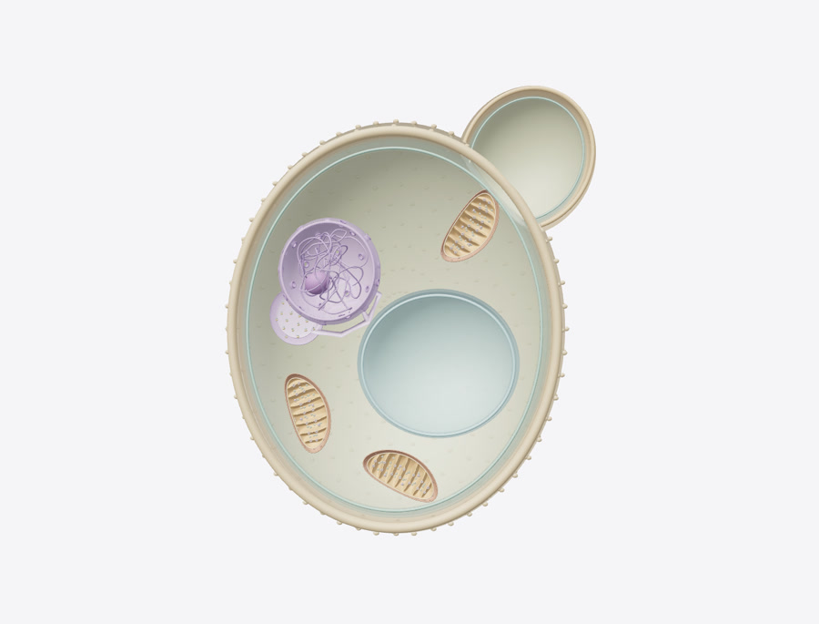
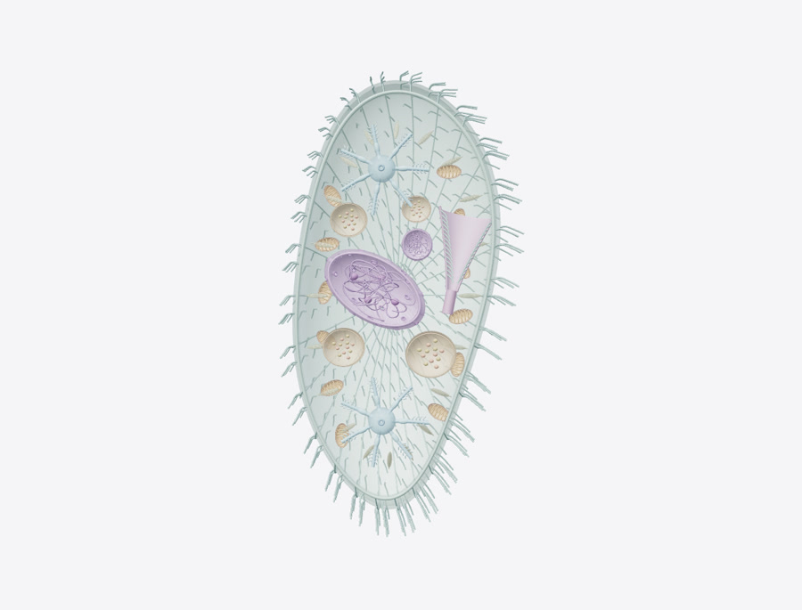
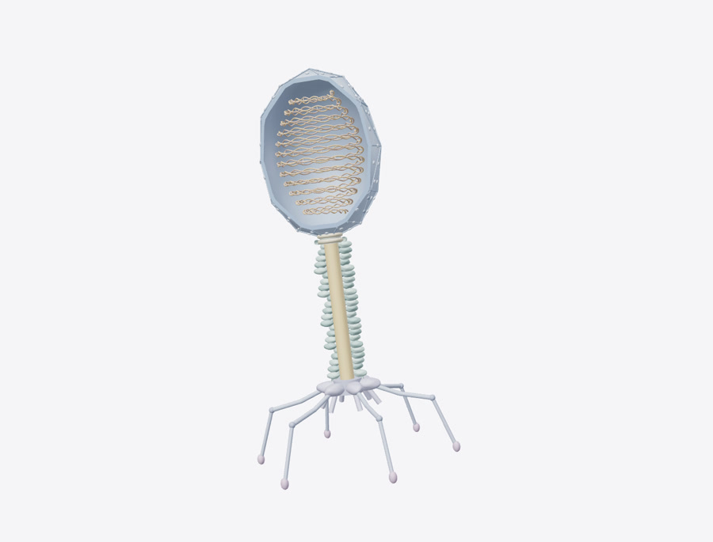
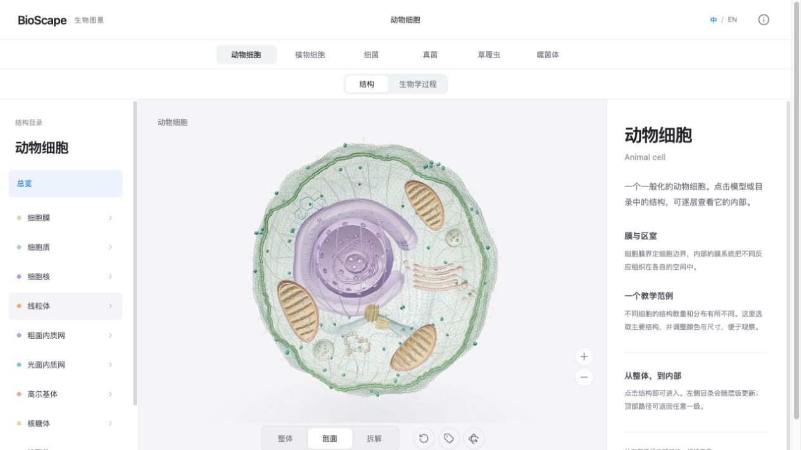
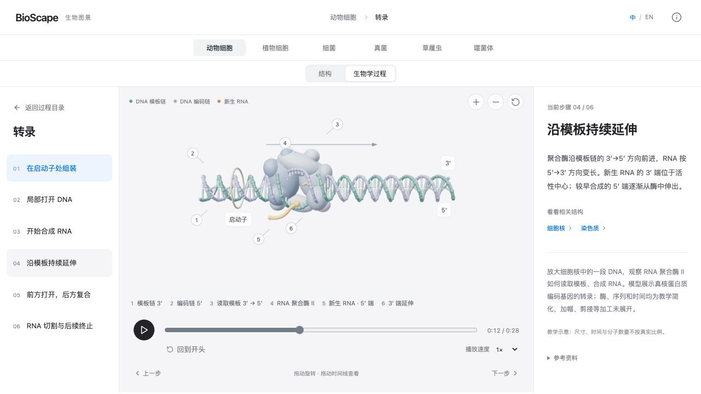

<div align="center">

# BioScape

### A closer look at life.

Explore biological structures and processes in an interactive, bilingual 3D world.

**[Explore online](https://sldyns.github.io/bioscape/)** · **[Watch the film](https://sldyns.github.io/bioscape/film.html)** · [简体中文](README.zh-CN.md)

[](https://sldyns.github.io/bioscape/) [](https://sldyns.github.io/bioscape/) [](LICENSE)

Created by **[Kun Qian](https://sldyns.github.io/)**

</div>

[](https://sldyns.github.io/bioscape/film.html)

<p align="center"><a href="https://sldyns.github.io/bioscape/film.html"><b>▶ Watch the introductory film</b></a> · 50 seconds · 1080p · Actual project models and animations</p>

A cell is easier to understand when you can look inside it. BioScape lets you turn a structure in your hands, open its layers, and follow the processes that make it work—from a whole cell to chromatin, from transcription to a growing protein.

**Six entry points. 84 biological processes. Chinese and English throughout.** Runs in your browser, with no account or installation required.

## Six ways into the microscopic world

<table>
<tr>
<td width="33%"><a href="https://sldyns.github.io/bioscape/#/cell"></a><br><b>Animal cell</b><br><sub>Membranes, organelles and molecular machinery.</sub></td>
<td width="33%"><a href="https://sldyns.github.io/bioscape/#/plant"></a><br><b>Plant cell</b><br><sub>Cell walls, chloroplasts and a central vacuole.</sub></td>
<td width="33%"><a href="https://sldyns.github.io/bioscape/#/bacterium"></a><br><b>Bacterium</b><br><sub>A closer look at a prokaryotic cell.</sub></td>
</tr>
<tr>
<td><a href="https://sldyns.github.io/bioscape/#/yeast"></a><br><b>Fungi · yeast</b><br><sub>A representative unicellular fungus.</sub></td>
<td><a href="https://sldyns.github.io/bioscape/#/paramecium"></a><br><b>Paramecium</b><br><sub>One cell, many specialized functions.</sub></td>
<td><a href="https://sldyns.github.io/bioscape/#/phage"></a><br><b>Bacteriophage</b><br><sub>Beyond cells: a virus and its architecture.</sub></td>
</tr>
</table>

Each entry uses a stated representative model; it does not stand for every species in its group.

## From the whole, to what is inside

[](https://sldyns.github.io/bioscape/#/cell)

- **Go deeper.** Click a structure or its directory entry to enter the next level. The nucleus opens into its components; chromatin leads to nucleosomes and DNA.
- **Change your perspective.** Rotate and zoom, then use whole, cutaway or exploded views where they apply.
- **Keep your bearings.** The structure directory and breadcrumb follow your position. Return to a parent without starting again.

## From structure, to activity

[](https://sldyns.github.io/bioscape/#/cell?view=process&process=transcription)

Follow a process at your own pace: play it, pause it, drag the timeline, or jump directly to a step. Selected lessons include experimental-condition controls and links back to related structures.

| Explore                  | Examples                                                           |
| ------------------------ | ------------------------------------------------------------------ |
| **Genetic information**  | DNA replication, transcription, RNA processing, translation        |
| **Gene regulation**      | Promoters, enhancers, chromatin accessibility, loops and TADs      |
| **Energy and transport** | Photosynthesis, respiration, membrane transport, protein secretion |
| **Cells in action**      | Division, signaling, microbial life cycles and phage infection     |

[**Browse the process directory →**](https://sldyns.github.io/bioscape/#/cell?view=process)

## Made for exploration

| Control                               | Action                                   |
| ------------------------------------- | ---------------------------------------- |
| Drag / mouse wheel                    | Rotate / zoom                            |
| Click a model part or directory entry | Open that structure                      |
| Timeline / step directory             | Scrub or jump through a process          |
| 中文 / EN                             | Switch language while keeping your place |
| Copy the page URL                     | Share the current structure or process   |

Touch controls and zoom buttons are included. A desktop browser with WebGL 2 support is recommended for the detailed models.

## Scientific context

BioScape is an educational visualization. Color, scale, timing and molecular counts are simplified to make relationships visible. Cutaways, exploded arrangements and enlarged mechanisms are viewing aids. Where experimental coordinates are used, their source and scope are identified; an illustrative animation is not an atomistic simulation.

Model-specific notes and references are available in the viewer. For the review and validation methodology, see the [scientific review](docs/science-audit/acceptance/README.md), [validation scope](docs/science-audit/acceptance/VALIDATION.md) and [third-party sources](THIRD_PARTY_NOTICES.md).

## Run locally

Requires Node.js 22; see [.nvmrc](.nvmrc).

```sh
git clone https://github.com/sldyns/bioscape.git
cd bioscape
npm ci
npm run dev
```

```sh
npm run check    # Formatting, regression checks, build and release validation
npm run preview  # Serve the production build locally
```

<details>
<summary><b>Architecture & contributing</b></summary>

React + Three.js + Vite. Static hosting; no backend, account system or API keys.

| Area                                       | Location                                               |
| ------------------------------------------ | ------------------------------------------------------ |
| Navigation and bilingual structure catalog | `src/App.jsx`, `src/navigation.js`, `src/catalog/`     |
| Structure modeling, rendering and workers  | `src/CellScene.jsx`, `src/scene/`                      |
| Process catalog and lazy loading           | `src/processes/catalog.js`, `src/processes/loaders.js` |
| Process models and scientific regressions  | `src/processes/modules/`                               |
| Validation and maintenance                 | `tests/`, `scripts/`, `docs/`                          |

Start with the [contribution guide](CONTRIBUTING.md), [documentation index](docs/README.md) or [deployment guide](docs/RELEASING.md). The [media production notes](scripts/media/README.md) describe how the film was made from the project models.

</details>

## License & attribution

© 2026 **[Kun Qian](https://sldyns.github.io/)**. Original project material is available under the [BioScape Noncommercial License 1.0](LICENSE).

**Noncommercial learning, research, teaching, modification and sharing are permitted under the license. Commercial use requires prior written permission from Kun Qian.** Retain the author attribution, license and applicable notices. This is source-available software, not an OSI-approved open-source license. Third-party software and experimental data retain their own terms.

[License](LICENSE) · [Third-party notices](THIRD_PARTY_NOTICES.md) · [Citation](CITATION.cff) · [Contact for commercial permission](mailto:kunqian@stu.pku.edu.cn)
