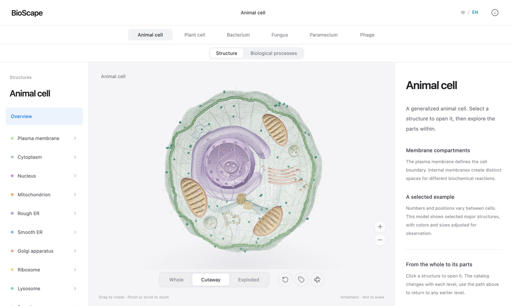
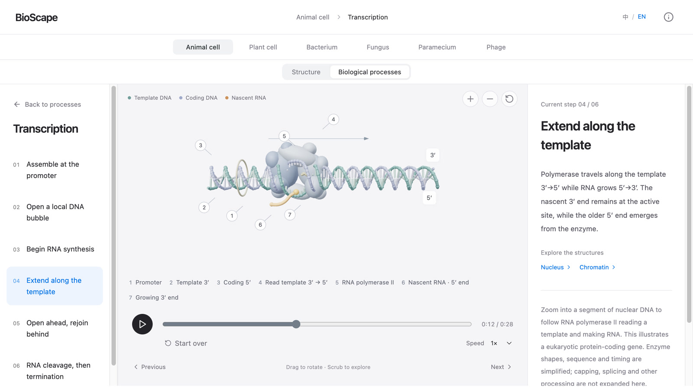

<div align="center">

# BioScape

### A closer look at life.

Explore biological structures and processes in three dimensions.

<a href="https://sldyns.github.io/bioscape/">Explore BioScape ↗</a> · <a href="README.zh-CN.md">简体中文</a>

</div>

https://github.com/user-attachments/assets/aef051f6-ff7b-4f08-ac92-f0a5da6f4082

## Explore the microscopic world

<table>
<tr>
<td width="33%" align="center"><a href="https://sldyns.github.io/bioscape/#/cell"></a><br/><strong>Animal cell</strong></td>
<td width="33%" align="center"><a href="https://sldyns.github.io/bioscape/#/plant"></a><br/><strong>Plant cell</strong></td>
<td width="33%" align="center"><a href="https://sldyns.github.io/bioscape/#/bacterium"></a><br/><strong>Bacterium</strong></td>
</tr>
<tr>
<td width="33%" align="center"><a href="https://sldyns.github.io/bioscape/#/yeast"></a><br/><strong>Yeast</strong></td>
<td width="33%" align="center"><a href="https://sldyns.github.io/bioscape/#/paramecium"></a><br/><strong>Paramecium</strong></td>
<td width="33%" align="center"><a href="https://sldyns.github.io/bioscape/#/phage"></a><br/><strong>Bacteriophage</strong></td>
</tr>
</table>

## From the whole, to within

Open a cell, enter an organelle, and follow its structures down to the molecular scale. Rotate, cut away or take apart a model to see how its components fit together.



## Follow the process

Watch transcription unfold, trace energy through photosynthesis, or follow a growing peptide chain. Move through the steps, pause at a detail, and return to the structures that make it possible.



<details>
<summary><strong>Scientific context</strong></summary>

Models carry their own explanations and references. Geometry, proportions and timing are teaching simplifications; experimental structures are attributed separately. See the [scientific review](docs/science-audit/acceptance/README.md) and [validation scope](docs/science-audit/acceptance/VALIDATION.md).

</details>

## Development

```sh
npm ci
npm run dev
```

Run `npm run check` before publishing. Node.js 22.12+ is required.

[Contributing](.github/CONTRIBUTING.md) · [Documentation](docs/README.md) · [Making the films](scripts/media/README.md)

---

Created by **[Kun Qian](https://sldyns.github.io/)** · © 2026

[Noncommercial license](LICENSE). Commercial use requires [written permission](mailto:kunqian@stu.pku.edu.cn). [Third-party notices](docs/legal/THIRD_PARTY_NOTICES.md).
