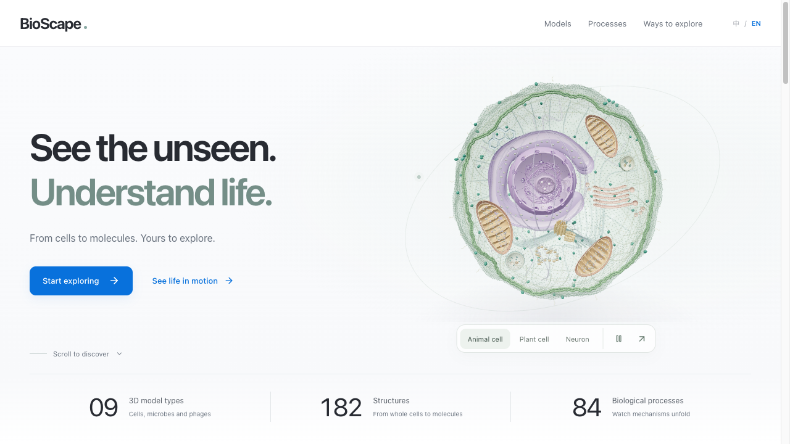
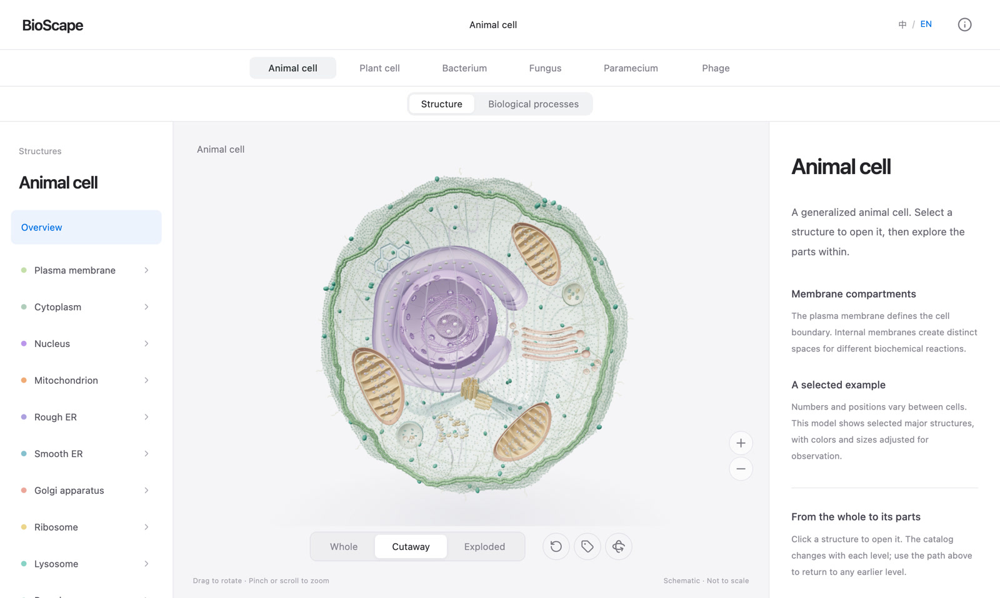
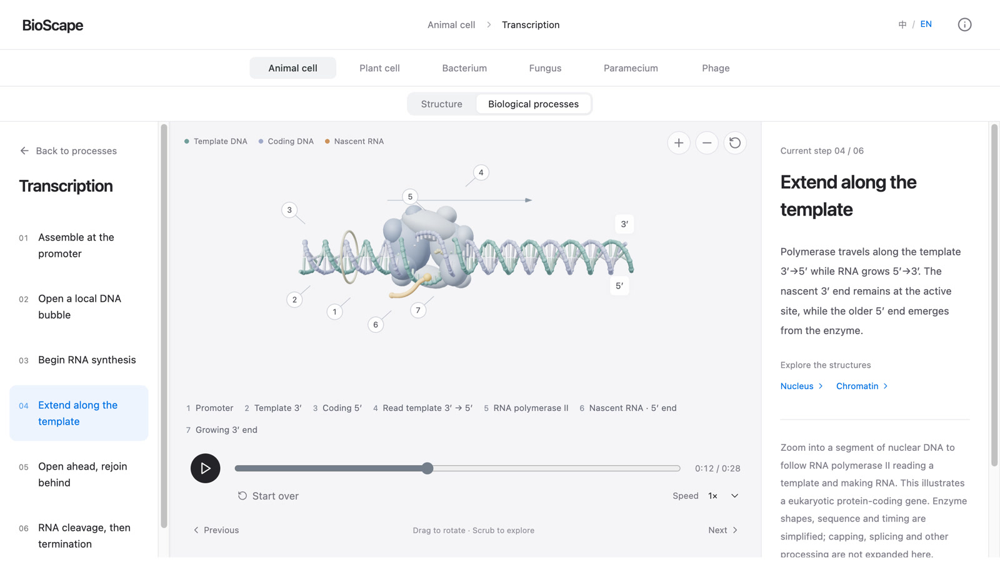

<div align="center">

# BioScape

An interactive atlas of biological structures and processes.

[Explore BioScape ↗](https://sldyns.github.io/bioscape/) &nbsp; · &nbsp; [简体中文](README.zh-CN.md)

</div>

[](https://sldyns.github.io/bioscape/)

## A place to begin

Nine model types, 182 structures and 84 processes, with Chinese and English throughout. Start with a familiar cell, look inside an organelle, or follow a process one step at a time.

<table>
<tr>
<td width="33%" align="center">
<a href="https://sldyns.github.io/bioscape/#/cell"></a><br/>
<a href="https://sldyns.github.io/bioscape/#/cell"><strong>Animal cell</strong></a><br/>
<sub>Organ&shy;elles within</sub>
</td>
<td width="33%" align="center">
<a href="https://sldyns.github.io/bioscape/#/plant"></a><br/>
<a href="https://sldyns.github.io/bioscape/#/plant"><strong>Plant cell</strong></a><br/>
<sub>Leaf meso&shy;phyll</sub>
</td>
<td width="33%" align="center">
<a href="https://sldyns.github.io/bioscape/#/bacterium"></a><br/>
<a href="https://sldyns.github.io/bioscape/#/bacterium"><strong>Bacte&shy;rium</strong></a><br/>
<sub>Gram-negative rod</sub>
</td>
</tr>
<tr>
<td width="33%" align="center">
<a href="https://sldyns.github.io/bioscape/#/yeast"></a><br/>
<a href="https://sldyns.github.io/bioscape/#/yeast"><strong>Budding yeast</strong></a><br/>
<sub>A uni&shy;cellular fungus</sub>
</td>
<td width="33%" align="center">
<a href="https://sldyns.github.io/bioscape/#/paramecium"></a><br/>
<a href="https://sldyns.github.io/bioscape/#/paramecium"><strong>Para&shy;mecium</strong></a><br/>
<sub>A ciliated single cell</sub>
</td>
<td width="33%" align="center">
<a href="https://sldyns.github.io/bioscape/#/phage"></a><br/>
<a href="https://sldyns.github.io/bioscape/#/phage"><strong>T₂ phage</strong></a><br/>
<sub>A virus of bacteria</sub>
</td>
</tr>
<tr>
<td width="33%" align="center">
<a href="https://sldyns.github.io/bioscape/#/erythrocyte"></a><br/>
<a href="https://sldyns.github.io/bioscape/#/erythrocyte"><strong>Red blood cell</strong></a><br/>
<sub>Mature human erythro&shy;cyte</sub>
</td>
<td width="33%" align="center">
<a href="https://sldyns.github.io/bioscape/#/neuron"></a><br/>
<a href="https://sldyns.github.io/bioscape/#/neuron"><strong>Neuron</strong></a><br/>
<sub>Myeli&shy;nated and multi&shy;polar</sub>
</td>
<td width="33%" align="center">
<a href="https://sldyns.github.io/bioscape/#/muscleFibre"></a><br/>
<a href="https://sldyns.github.io/bioscape/#/muscleFibre"><strong>Muscle fibre</strong></a><br/>
<sub>Human skeletal muscle</sub>
</td>
</tr>
</table>

## From structure to process

Rotate a model, open a cutaway, or separate its parts. Follow the hierarchy from a whole cell towards molecular structures, then enter the processes that take place there.

<table>
<tr>
<td width="50%"></td>
<td width="50%"></td>
</tr>
<tr>
<td valign="top"><strong>Look closer</strong><br/>Choose a structure to explore its parts, read its explanation and find related processes.</td>
<td valign="top"><strong>Follow the steps</strong><br/>Play, pause or move through a process. Return to the model with your view preserved.</td>
</tr>
</table>

Begin with [transcription](https://sldyns.github.io/bioscape/#/cell?view=process&process=transcription), [photosynthesis](https://sldyns.github.io/bioscape/#/plant?view=process&process=photosynthesis) or [an action potential](https://sldyns.github.io/bioscape/#/neuron?view=process&process=actionPotential).

## Make the view your own

**Compare.** Place two models side by side, each with its own view, cutaway, labels and disassembly controls. Comparison notes explain the specimens represented; the views are fitted independently, without a common physical scale.

**Create.** Compose images and short films in Studio. Choose landscape, portrait or square; export a PNG with an optional transparent background, or record an orbit, disassembly or biological process.

**Return and share.** Pick up where you left off from the homepage. Share a link to a model, a process in progress or both comparison panes, with the view and display settings included.

<details>
<summary>View the comparison workspace</summary>


</details>

<details>
<summary>Watch the introductory film</summary>

https://github.com/user-attachments/assets/aef051f6-ff7b-4f08-ac92-f0a5da6f4082

</details>

<details>
<summary>Export and sharing details</summary>

Images support 1920 or 2560 pixel long edges. Videos use MP4 or WebM according to browser support. Titles and labels are optional; exports retain the BioScape project mark and teaching context, without an author-name watermark.

Shared links use the current site address. A link made on a local server requires access to that server.

</details>

## About the models

BioScape is made for exploring and teaching biology. Each model has its own scope, explanations and references. Geometry, proportions and timing include teaching simplifications; experimental structures are attributed separately.

[Scientific review](docs/science-audit/acceptance/README.md) · [Validation scope](docs/science-audit/acceptance/VALIDATION.md) · [Third-party notices](docs/legal/THIRD_PARTY_NOTICES.md)

## Run locally

With Node.js 22.12 or newer:

```sh
npm ci
npm run dev
```

Run `npm run check` before publishing.

[Contributing](.github/CONTRIBUTING.md) · [Documentation](docs/README.md) · [Making the films](scripts/media/README.md)

---

Created by **[Kun Qian](https://sldyns.github.io/)** · © 2026

Available under the [noncommercial license](LICENSE). Commercial use requires [written permission](mailto:kunqian@stu.pku.edu.cn).

When sharing exported images or videos, include the project and author credit, author homepage and applicable license notices in the caption, description or credits.
