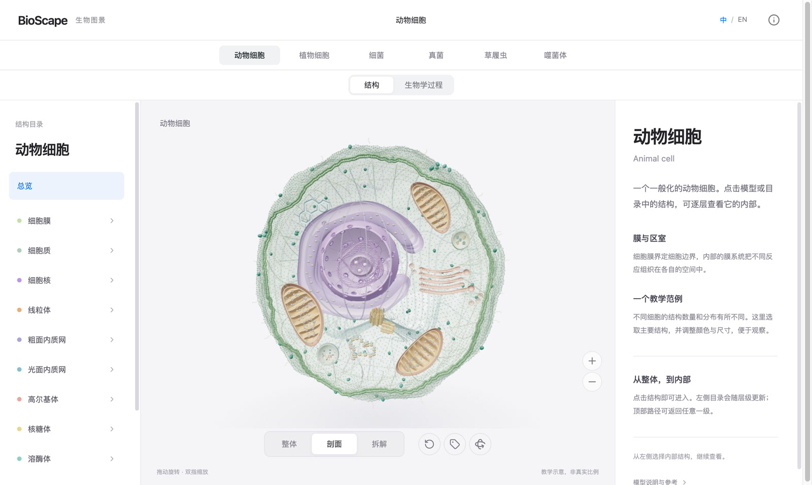
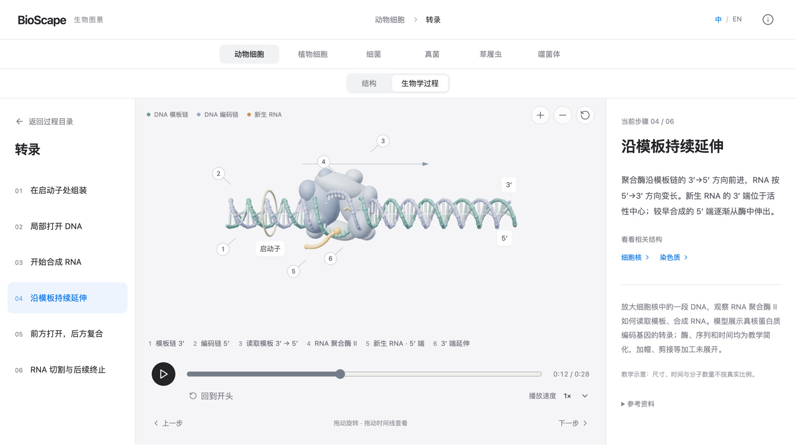

<div align="center">

# BioScape

### 看见微观。理解生命。

在三维世界中，探索生物结构与生命过程。

<a href="https://sldyns.github.io/bioscape/">进入 BioScape ↗</a> · <a href="README.md">English</a>

</div>

https://github.com/user-attachments/assets/905f474c-2173-4c98-b542-b1d3c5a84258

## 走进微观世界

<table>
<tr>
<td width="33%" align="center"><a href="https://sldyns.github.io/bioscape/#/cell"></a><br/><strong>动物细胞</strong></td>
<td width="33%" align="center"><a href="https://sldyns.github.io/bioscape/#/plant"></a><br/><strong>植物细胞</strong></td>
<td width="33%" align="center"><a href="https://sldyns.github.io/bioscape/#/bacterium"></a><br/><strong>细菌</strong></td>
</tr>
<tr>
<td width="33%" align="center"><a href="https://sldyns.github.io/bioscape/#/yeast"></a><br/><strong>酵母</strong></td>
<td width="33%" align="center"><a href="https://sldyns.github.io/bioscape/#/paramecium"></a><br/><strong>草履虫</strong></td>
<td width="33%" align="center"><a href="https://sldyns.github.io/bioscape/#/phage"></a><br/><strong>噬菌体</strong></td>
</tr>
</table>

## 由整体，深入内部

打开细胞，进入细胞器，再沿着结构层级走向分子尺度。旋转、剖视或拆解模型，看清各部分如何连接。



## 让过程变得可见

观察转录如何进行，追踪光合作用中的能量转化，跟随肽链逐步延长。逐步查看、随时暂停，再回到相关结构，理解过程发生的原因。



<details>
<summary><strong>科学说明</strong></summary>

各模型附有说明与参考资料。几何形态、比例和时间经过教学简化，实验结构单独注明来源。详见[科学审查](docs/science-audit/acceptance/README.md)与[验证范围](docs/science-audit/acceptance/VALIDATION.md)。

</details>

## 本地开发

```sh
npm ci
npm run dev
```

发布前运行 `npm run check`。需要 Node.js 22.12 或更新版本。

[维护指南](.github/CONTRIBUTING.md) · [文档索引](docs/README.md) · [影片制作](scripts/media/README.md)

---

**[Kun Qian](https://sldyns.github.io/)** 创作 · © 2026

依[非商业许可](LICENSE)使用；商用须获得[书面授权](mailto:kunqian@stu.pku.edu.cn)。[第三方声明](docs/legal/THIRD_PARTY_NOTICES.md)。
