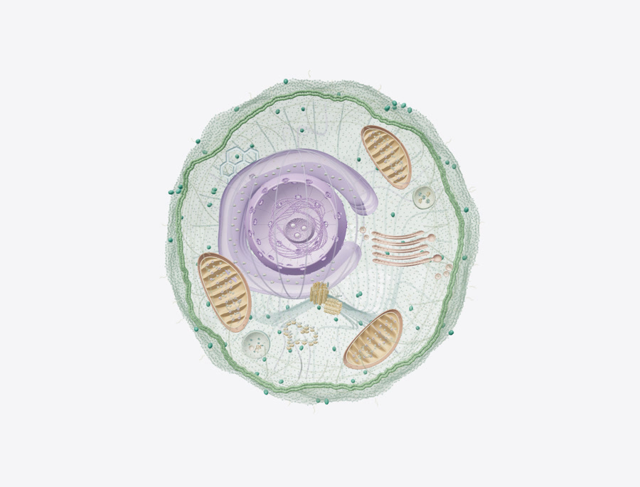
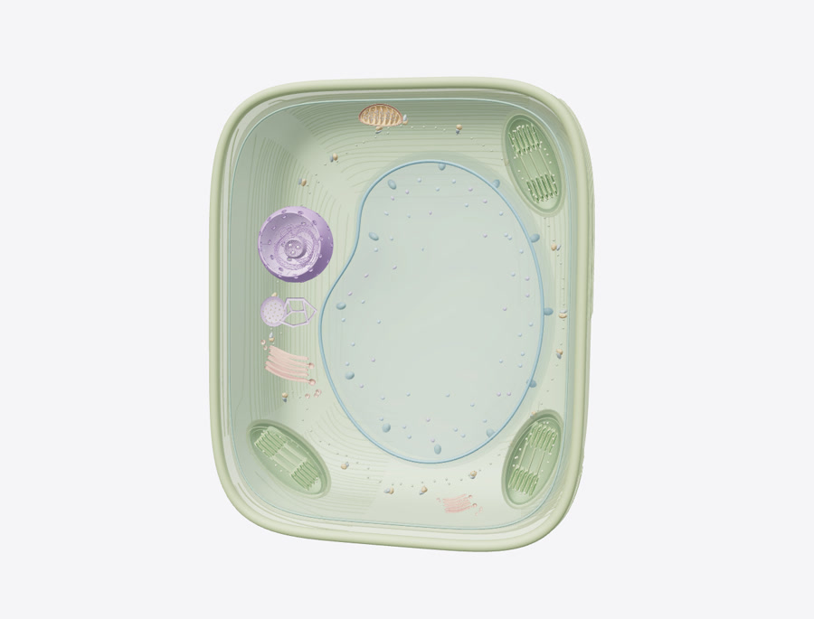
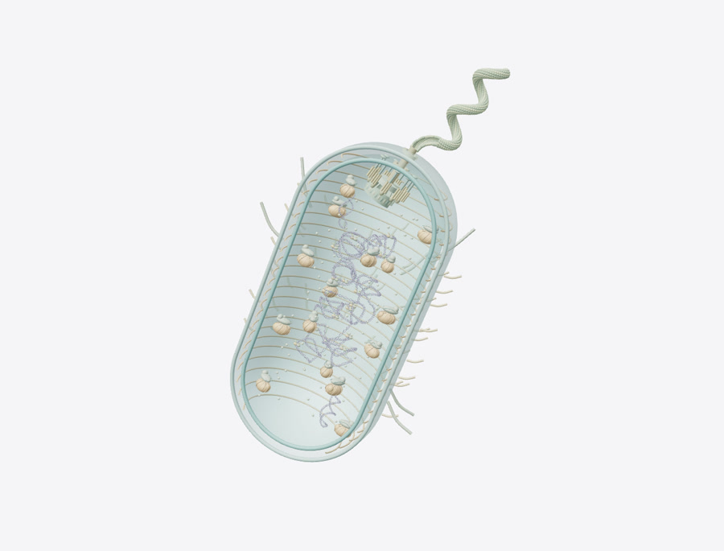
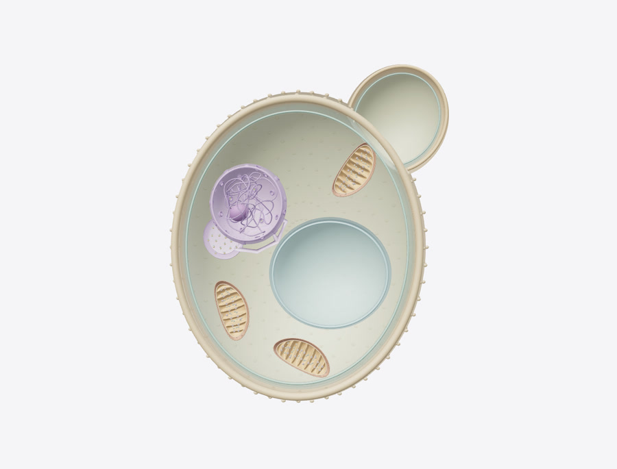
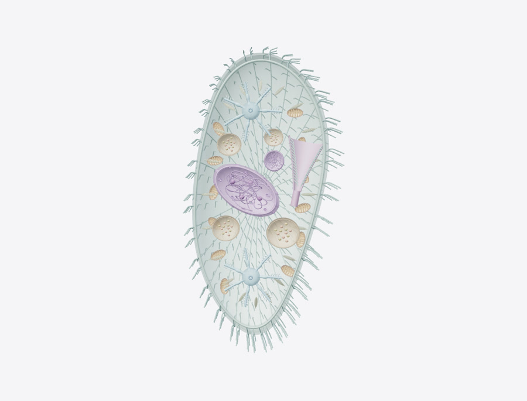
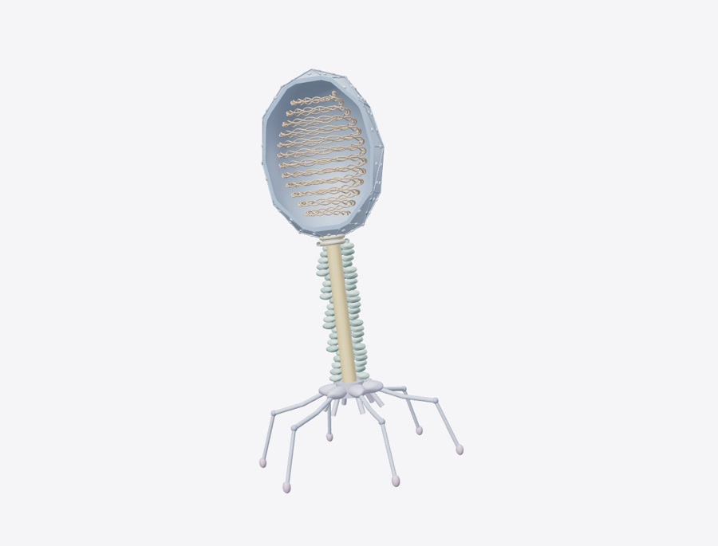

<div align="center">

# BioScape

### 看见微观。理解生命。

在三维世界中，探索生物结构与生命过程。

<a href="https://sldyns.github.io/bioscape/">进入 BioScape ↗</a> · <a href="README.md">English</a>

</div>

https://github.com/user-attachments/assets/905f474c-2173-4c98-b542-b1d3c5a84258

## 走进微观世界

主页汇集九类模型与 84 个生命过程。可以旋转首屏模型、浏览模型图鉴，也可以用中英文搜索过程。探索途中随时回到主页，再从保存的场景继续。

<table>
<tr>
<td width="33%" align="center"><a href="https://sldyns.github.io/bioscape/#/cell"></a><br/><strong>动物细胞</strong></td>
<td width="33%" align="center"><a href="https://sldyns.github.io/bioscape/#/plant"></a><br/><strong>植物细胞</strong></td>
<td width="33%" align="center"><a href="https://sldyns.github.io/bioscape/#/bacterium"></a><br/><strong>细菌</strong></td>
</tr>
<tr>
<td width="33%" align="center"><a href="https://sldyns.github.io/bioscape/#/yeast"></a><br/><strong>酵母</strong></td>
<td width="33%" align="center"><a href="https://sldyns.github.io/bioscape/#/paramecium"></a><br/><strong>草履虫</strong></td>
<td width="33%" align="center"><a href="https://sldyns.github.io/bioscape/#/phage"></a><br/><strong>噬菌体</strong></td>
</tr>
</table>

## 由整体，深入内部

打开细胞，进入细胞器，再沿着结构层级走向分子尺度。旋转、剖视或拆解模型，看清各部分如何连接。


## 让过程变得可见

观察转录如何进行，追踪光合作用中的能量转化，跟随肽链逐步延长。逐步查看、随时暂停，再回到相关结构，理解过程发生的原因。


## 连起来看，并排比较

从结构直接进入相关过程，回到原处时保留视角与拆解状态；再次进入过程，可以继续刚才的进度。成熟人红细胞、有髓多极神经元和骨骼肌纤维也可以逐层探索。

点击「对比」，分别选择两个模型。两侧独立旋转、缩放与复位，也可分别调整整体、剖面、拆解和标签；差异说明标明模型的生物学范围。两边各自适配画面，不使用统一的真实比例尺。


## 把观察带走

「影像工作台」支持横版、竖版和方形构图，导出 1920 或 2560 像素长边的 PNG，以及旋转、拆解或过程短视频。图片可用透明背景；视频按浏览器能力保存为 MP4 或 WebM。标签与标题可选，画面保留 BioScape 项目标识与教学说明，不添加作者姓名水印。

「分享」保存当前模型、视角、显示设置和过程进度，也支持双模型对比。链接指向当前站点；本地地址仅在能访问该本地服务的设备上打开。

<details>
<summary><strong>科学说明</strong></summary>

各模型附有说明与参考资料。几何形态、比例和时间经过教学简化，实验结构单独注明来源。详见[科学审查](docs/science-audit/acceptance/README.md)与[验证范围](docs/science-audit/acceptance/VALIDATION.md)。

</details>

## 本地开发

```sh
npm ci
npm run dev
```

发布前运行 `npm run check`。需要 Node.js 22.12 或更新版本。

[维护指南](.github/CONTRIBUTING.md) · [文档索引](docs/README.md) · [影片制作](scripts/media/README.md)

---

**[Kun Qian](https://sldyns.github.io/)** 创作 · © 2026

依[非商业许可](LICENSE)使用；商用须获得[书面授权](mailto:kunqian@stu.pku.edu.cn)。[第三方声明](docs/legal/THIRD_PARTY_NOTICES.md)。

网页页脚提供项目介绍、完整许可与商用联系入口。分享导出的图片或视频时，请在配文、视频简介或致谢中保留项目与作者署名、作者主页及适用的许可说明。
